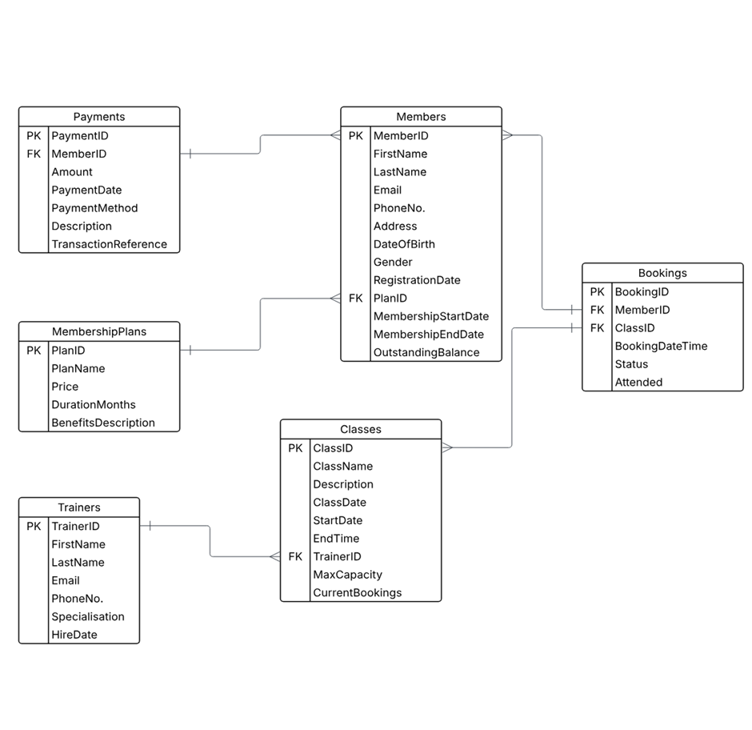

# Description
A MySQL database schema and sample data for a gym management system.

## Project Overview
This repository contains the SQL scripts and documentation for a relational database designed for an gym management platform. The database schema supports managing membership plans, members, trainers, classes, and more.

## Features
-   **Normalized Schema:** Designed using third normal form (3NF) principles to minimize data redundancy.
-   **Referential Integrity:** Enforced with foreign keys to maintain data consistency.
-   **Sample Data:** Includes `data.sql` to populate the database with example records for testing.
-   **Stored Procedures & Functions:** Examples like `add_new_member`, `update_Membership_plan`.
-   **Queries:** Common queries such as `get details of members on specific plan`, or `find the most popular class`.
-   **Views:** Pre-defined views for common reporting needs.

## Database Schema
- **GymSystem ER diagram:**



## Getting Started

### Prerequisites
-   MySQL Server (version 8.0 or higher)
-   A MySQL client (MySQL Workbench, DBeaver, or command-line client)

### Installation and Execution
1.  **Clone the repository:**
    ```bash
    git clone [https://github.com/t3chE/GymSystem.git](https://github.com/t3chE/GymSystem.git)
    cd GymSystem
    ```

2.  **Connect to your MySQL server.**


3.  **Execute the schema script:**
    ```sql
    -- In your MySQL client or terminal:
    SOURCE schema.sql;
    ```
    This script will create the 'gymdb' database and all necessary tables.
    (Alternatively, copy and paste the contents of `schema.sql` into your client and execute.)


4.  **Execute the data script:**
    ```sql
    -- After creating the schema:
    USE gym_db; 
    SOURCE data.sql;
    ```
    This script will populate the tables with sample data.


5. **Add Procedures and Views (Optional):**
    ```sql
    -- If applicable, execute `procedures.sql` and `views.sql`:
    SOURCE procedures.sql;
           views.sql;
    ```
    These scripts can be added to execute particular procedures and data views.


6. **Execute the queries script:**
    ```sql
    -- Once all other scripts have been run:
    SOURCE queries.sql;
    ```
    This file contains scripts used for ad-hoc testing or providing examples for other developers.

```
Contact
•	[https://github.com/t3chE](https://github.com/t3chE)
•	[https://www.linkedin.com/in/linkgus/](https://www.linkedin.com/in/linkgus/)
```
